# Roastline Coffee — Telegram Shop Bot

[](https://github.com/KirillHat/coffee-bot/actions/workflows/ci.yml)
[](https://codecov.io/gh/KirillHat/coffee-bot)
[](https://www.python.org/downloads/)
[](https://docs.aiogram.dev/)
[](https://github.com/astral-sh/ruff)
[](https://core.telegram.org/bots/payments)
[](https://kirillhat.github.io/coffee-bot-webapp/)
[](Dockerfile)
[](LICENSE)
[](https://t.me/VelvetMorning_bot)

A production-ready Telegram bot for a small e-commerce store, written with **aiogram 3** and **SQLite**. It ships with a realistic specialty-coffee catalogue, a full cart and checkout flow with **Telegram Payments** (Smart Glocal/Stripe), promo codes, order status tracking with auto-DMs, an admin sales dashboard, inline search, rate limiting and an embedded **React+Tailwind WebApp** mini-app.

> Built as a portfolio project to demonstrate clean async Python, aiogram 3 best practices and a solid project structure that scales beyond a toy example.

**Live demo:** [@VelvetMorning_bot](https://t.me/VelvetMorning_bot) · **WebApp:** [kirillhat.github.io/coffee-bot-webapp](https://kirillhat.github.io/coffee-bot-webapp/)

---

## 🎬 Demo

<p align="center">
  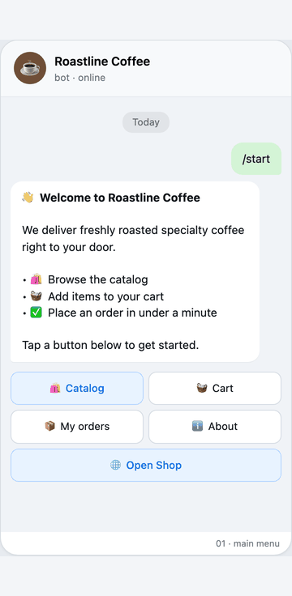
</p>

## 📸 Screenshots

<table>
  <tr>
    <td align="center">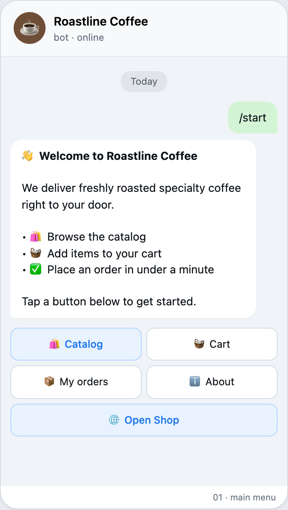<br/><sub>Main menu</sub></td>
    <td align="center">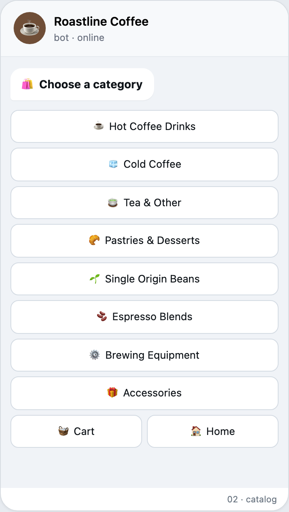<br/><sub>Catalog (8 categories)</sub></td>
    <td align="center">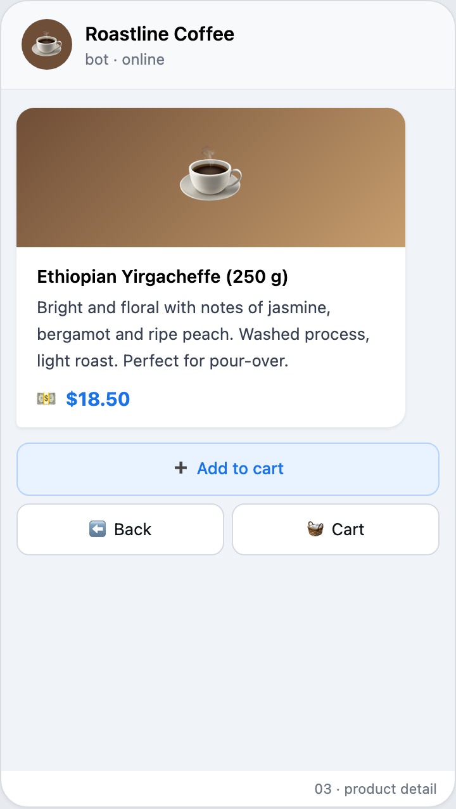<br/><sub>Product card</sub></td>
    <td align="center">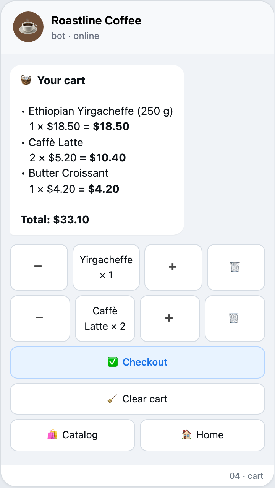<br/><sub>Cart with quantity controls</sub></td>
  </tr>
  <tr>
    <td align="center">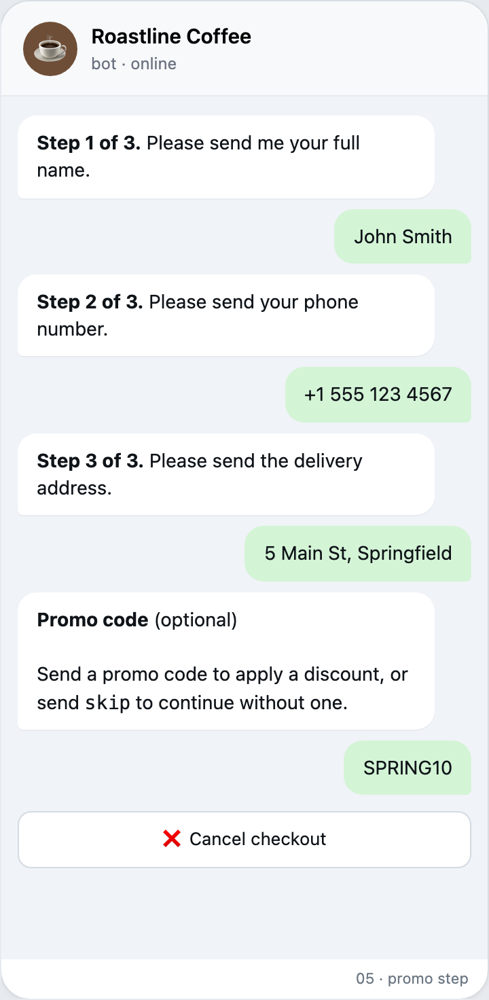<br/><sub>Checkout — promo step</sub></td>
    <td align="center">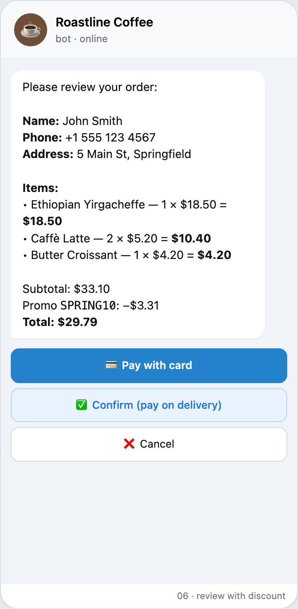<br/><sub>Review with discount</sub></td>
    <td align="center">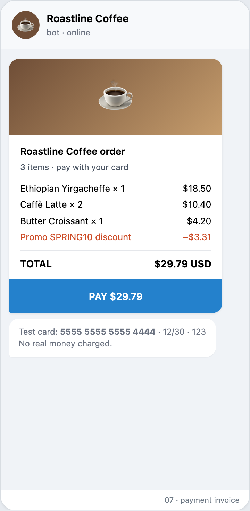<br/><sub>💳 Telegram Payments</sub></td>
    <td align="center">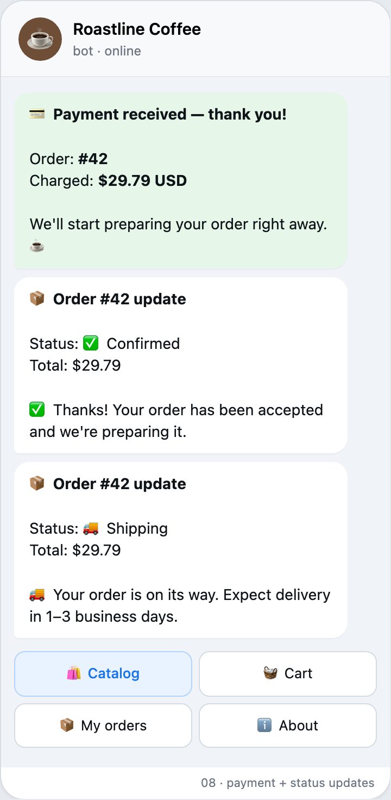<br/><sub>Payment + status updates</sub></td>
  </tr>
  <tr>
    <td align="center">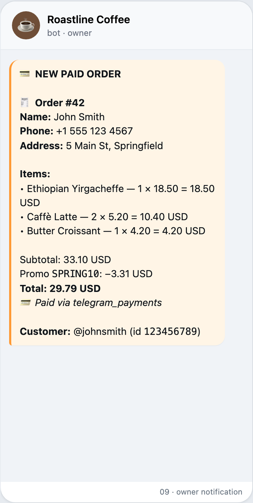<br/><sub>Owner DM on new order</sub></td>
    <td align="center">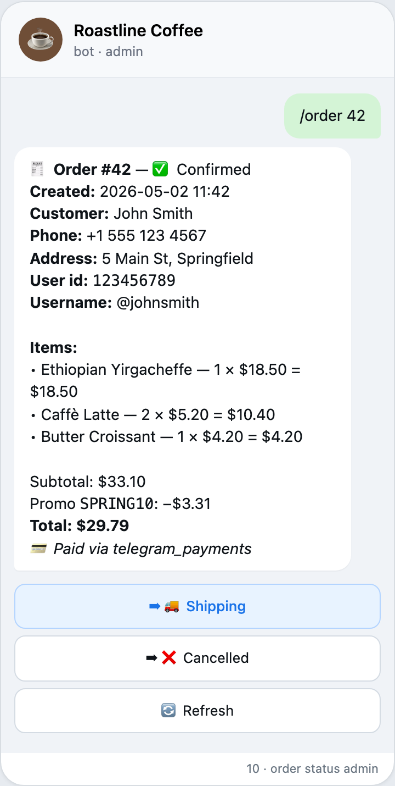<br/><sub>Admin <code>/order</code></sub></td>
    <td align="center">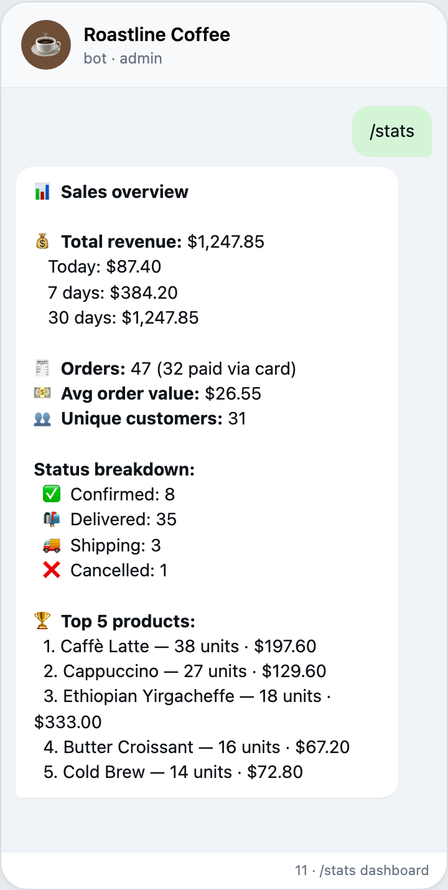<br/><sub>Admin <code>/stats</code></sub></td>
    <td align="center">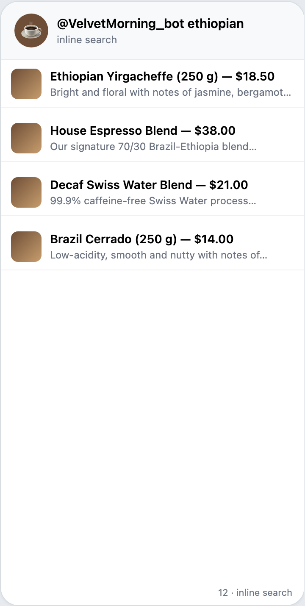<br/><sub>Inline search</sub></td>
  </tr>
  <tr>
    <td align="center">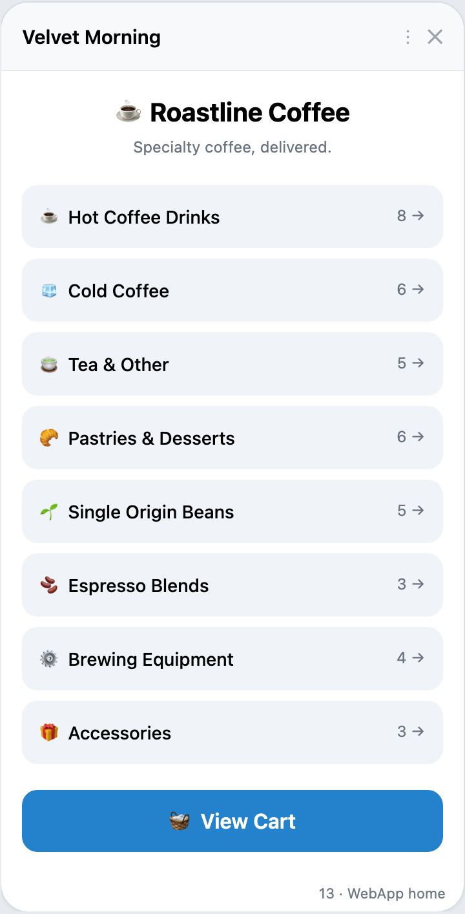<br/><sub>WebApp home</sub></td>
    <td align="center">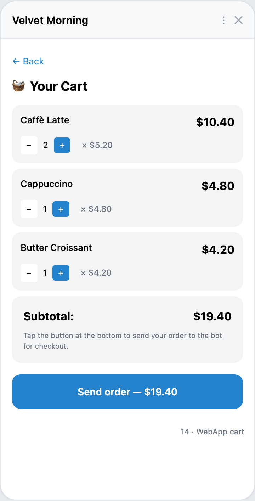<br/><sub>WebApp cart</sub></td>
    <td colspan="2"></td>
  </tr>
</table>

> Screenshots are pixel-clean Telegram-styled mockups generated from
> [`screenshots/mockups.html`](screenshots/mockups.html) via Playwright —
> see [`screenshots/README.md`](screenshots/README.md) for details on
> regenerating them after changes.

---

## ✨ Features

### Customer-facing
- **Browsable catalogue** — categories → products → product card with photo, price and description, ordered by deliberate cafe flow (drinks → food → beans → equipment → accessories) instead of alphabet
- **Cart** — add, increment, decrement, remove, clear; subtotals and grand total are recomputed on every change. Quantity changes are atomic at the SQL layer, so rapid double-tapping `+` never loses an increment
- **Checkout** — four-step FSM (name → phone → address → optional promo code) with input validation, order review and confirmation
- **💳 Card payments** — full **Telegram Payments** integration (Stripe / YooMoney). One tap sends the user to the native payment sheet; on success the order is created automatically and force-confirmed
- **🎁 Promo codes** — percent-off codes with min-subtotal and max-uses limits, validated against the cart at checkout
- **📦 Order status tracking** — every status change (`new → confirmed → shipping → delivered` or `cancelled`) auto-DMs the customer with a friendly update
- **🔍 Inline search** — type `@VelvetMorning_bot ethiopian` from any chat to share a product card, with a deep link back into the bot
- **🌐 Telegram WebApp** — full HTML+React catalog (Tailwind, native theme integration, haptic feedback) embedded in Telegram for users who prefer a swipey UI to inline keyboards

### Admin
- **Inline product wizard** — `/add_product` walks through category → name → desc → price → photo
- **Order management** — `/order <id>` shows the order with status-change buttons; `/set_status <id> <status>` does it in one line
- **Promo management** — `/promo` lists active codes; `/promo add` runs a 4-step wizard
- **📊 Sales dashboard** — `/stats` reports total / today / 7-day / 30-day revenue, paid-vs-unpaid order counts, average order value, status breakdown and top-5 products by units sold

### Operational
- **🚦 Rate limiting middleware** — sliding-window per-user quota (30 messages / 60 callbacks / minute) with admin bypass and friendly cooldown notices
- **👥 User tracking** — every interaction touches a `bot_users` table for `/stats` and future GDPR commands
- **🗄 Schema auto-migrations** — bot detects when `seed_data.py` drifted from the DB and rebuilds the catalog without touching order history; legacy column additions are applied via best-effort `ALTER TABLE`
- **🛡 HTML escaping & input validation** — all user-supplied fields are escaped; `callback_data` is bounded-int-validated against tampering and stale clicks
- **📋 Structured logging** — every error is logged with context; bot survives missing photo files, network blips and stale Telegram callbacks via graceful fallbacks

### Storage
- **SQLite via aiosqlite** — async I/O, FK on, single-file DB
- **Tables**: `categories`, `products`, `cart_items`, `orders`, `order_items`, `order_status_history`, `promo_codes`, `bot_users` — fully indexed
- **Auto-seeding** — first run inserts a 40-item demo catalog across 8 categories (hot & cold coffee, tea, pastries, single-origin beans, espresso blends, brewing equipment, accessories) so the bot is shoppable out of the box

## 🧱 Stack

| Layer            | Tool                              |
| ---------------- | --------------------------------- |
| Bot framework    | [aiogram 3.13](https://docs.aiogram.dev) |
| Storage          | SQLite via `aiosqlite`            |
| FSM              | aiogram in-memory storage         |
| Configuration    | `python-dotenv` + `dataclasses`   |
| Payments         | Telegram Payments (Stripe / YooMoney provider) |
| WebApp           | React 18 + Tailwind (CDN, no build) + Telegram WebApp JS API |
| Middleware       | Custom rate limiter + user tracking |
| Python           | 3.10+                             |

## 📂 Project structure

```
1_ecommerce_telegram_bot/
├── bot.py                       # Entry point — builds Bot, Dispatcher, Database, middlewares
├── config.py                    # Reads .env into a typed Config dataclass
├── database.py                  # Async SQLite layer + status workflow + promo + stats
├── handlers/
│   ├── __init__.py              # Router order: payments → webapp → start → admin → ...
│   ├── start.py                 # /start, /help, main menu, About, deep links
│   ├── catalog.py               # Categories, product list, product detail (photo or text fallback)
│   ├── cart.py                  # Cart screen + atomic quantity controls
│   ├── checkout.py              # 4-step FSM checkout (name → phone → address → promo)
│   ├── admin.py                 # /admin, /add_product, /stats, /orders_all, /categories
│   ├── order_admin.py           # /order, /set_status, /promo (status workflow + customer DMs)
│   ├── payments.py              # send_invoice, pre_checkout_query, successful_payment
│   ├── webapp.py                # Receives Telegram.WebApp.sendData and resumes checkout
│   └── inline_search.py         # @bot inline search across products
├── middlewares/
│   ├── rate_limit.py            # Sliding-window per-user quota
│   └── user_tracking.py         # Touches bot_users on every event
├── keyboards/
│   └── inline.py                # All inline keyboards (compact callback_data)
├── states/
│   └── order.py                 # CheckoutStates, AddProductStates, AddPromoStates
├── utils/
│   ├── parsing.py               # safe_int — defensive callback_data parsing
│   ├── telegram.py              # replace_or_edit — text/photo card swap helper
│   └── seed_data.py             # Catalog seeder with auto-detect drift + re-seed
├── webapp/
│   ├── index.html               # React 18 + Tailwind catalog (single file, no build)
│   ├── catalog.json             # Generated catalog data (built from seed_data)
│   └── build_catalog.py         # Dump utils/seed_data.PRODUCTS to catalog.json
├── assets/photos/               # 40 product photos (one per item)
├── requirements.txt
├── .env.example
└── README.md
```

## 🚀 Quick start

### 1. Create a bot

1. Open [@BotFather](https://t.me/BotFather) in Telegram, send `/newbot` and follow the prompts.
2. Copy the **HTTP API token** that BotFather gives you.
3. Find your own user id by messaging [@userinfobot](https://t.me/userinfobot).

### 2. Configure the project

```bash
git clone <this-repo>
cd 1_ecommerce_telegram_bot
python3 -m venv .venv
source .venv/bin/activate          # Windows: .venv\Scripts\activate
pip install -r requirements.txt
cp .env.example .env
```

Open `.env` and fill in:

```ini
BOT_TOKEN=123456789:ABCdef...        # from @BotFather
ADMIN_IDS=123456789                  # comma-separated user ids
OWNER_CHAT_ID=123456789              # where new-order alerts are sent
DB_FILENAME=shop.db
CURRENCY=USD
```

### 3. Run

```bash
python bot.py
```

You should see:

```
Bot is starting…
Seeded the catalog with 40 demo products.
```

Open your bot in Telegram and send `/start`.

## 🛍 User flow

1. **`/start`** — main menu with Catalog · Cart · My orders · About.
2. **🛍 Catalog** → category → product → ➕ Add to cart (capped at 99 per item).
3. **🧺 Cart** — change quantities (➖ / ➕), remove single items (🗑) or clear all.
   Quantity changes are atomic at the SQL layer, so rapid double-tapping `+`
   never loses an increment.
4. **✅ Checkout** — bot asks for name, phone, address (each step validated), then shows a summary screen.
5. **Confirm** — order is written to SQLite, the cart is emptied, and the owner gets a notification:

   ```
   🆕 New order received
   🧾 Order #4
   Name: Anna Smith
   Phone: +1 555 0142
   Address: 221B Baker Street, London
   …
   Total: 41.40 USD
   Customer: @anna · id 123456789
   ```

## 🔧 Admin commands

`ADMIN_IDS` in `.env` controls who can use these. From the admin's chat:

| Command                       | What it does                                                              |
| ----------------------------- | ------------------------------------------------------------------------- |
| `/admin`                      | Shows the admin help screen                                               |
| `/categories`                 | Lists categories with their ids                                           |
| `/add_product`                | Wizard: category id → name → desc → price → photo                         |
| `/orders_all`                 | Last 20 orders (id, time, customer, total, status)                        |
| `/order <id>`                 | Order detail with inline status-change buttons                            |
| `/set_status <id> <status>`   | Move an order through the workflow; customer is auto-DMed                 |
| `/promo`                      | List all promo codes with usage counters                                  |
| `/promo add`                  | 4-step wizard to create a new promo code                                  |
| `/stats`                      | Sales dashboard (revenue today/7d/30d, orders, AOV, top-5, status counts) |
| `/cancel`                     | Aborts the current admin action                                           |

Adding a product looks like this:

```
You> /add_product
Bot> Send the category id for the new product:
     1 — ☕ Single Origin Beans
     2 — 🫘 Espresso Blends
     ...
You> 1
Bot> Send the product name:
You> Brazil Cerrado (250g)
Bot> Send the description:
You> Chocolate, hazelnut, low acidity. Roasted last Tuesday.
Bot> Send the price:
You> 14.90
Bot> Send a photo URL (https://...) or type 'skip':
You> skip
Bot> ✅ Added product #10 — Brazil Cerrado (250g) for $14.90.
```

## 🗄 Database schema

`shop.db` is created on first launch:

- `categories(id, name, emoji)`
- `products(id, category_id → categories.id, name, description, price, photo_url, in_stock)`
- `cart_items(user_id, product_id → products.id, quantity)` — composite PK keeps duplicates impossible
- `orders(id, user_id, username, full_name, phone, address, total, status, created_at)` — `user_id` is what we filter on for "My orders" so a user without a Telegram username still sees only their own orders
- `order_items(order_id → orders.id, product_id, name, price, quantity)` — denormalised name/price keep historical receipts intact even if the product is later edited or deleted

Foreign keys and cascading deletes are enabled (`PRAGMA foreign_keys = ON`).

## 🧪 Manual test plan

After `python bot.py` is running:

1. `/start` → main menu shows.
2. Tap **Catalog** → all 8 categories listed.
3. Pick **Single Origin Beans** → 5 products appear.
4. Tap **Ethiopian Yirgacheffe (250 g)** → photo card with description + price.
5. Tap **Add to cart** twice → "Added: …" toast both times.
6. Open **Cart** → 2 × Yirgacheffe, total = $37.00.
7. Tap **➕** next to it → quantity becomes 3, total = $55.50.
8. Tap **Checkout** → enter `John Smith`, `+1 555 0123`, `5 Main St, Springfield`.
9. Confirm → user gets ✅, owner chat receives the order.
10. Run `/orders_all` from the admin account → the new order is at the top.
11. Tap **My orders** as the customer → only your own orders show, even with no Telegram username set.

## 🧪 Tests

The repo ships a **pytest suite** covering the database layer, parsing,
keyboards and rate limiter — 46 tests, runs under 2 seconds:

```bash
pip install -r requirements-dev.txt
pytest                  # run everything
pytest --cov=.          # with coverage report
```

GitHub Actions runs the suite on Python 3.10 / 3.11 / 3.12, plus
`ruff check` and a Docker image build, on every push / pull request.

## 🐳 Docker

One-command production deploy:

```bash
cp .env.example .env  &&  edit .env
docker compose up -d
docker compose logs -f
```

The compose stack:

- Builds a slim multi-stage image (~90 MB, runs as non-root user)
- Persists the SQLite DB on a named volume (`shop-data`) so it survives rebuilds
- Mounts `assets/` read-only for product photos
- Restarts on crash (`unless-stopped`) with health check + capped JSON logs

For local development, `python bot.py` after `source .venv/bin/activate`
still works — Docker is just one of three supported deployment paths.

## ☁️ Cloud deploy (Fly.io / Render)

Both blueprints are committed; pick whichever you prefer.

### Fly.io (one-time setup)

```bash
curl -L https://fly.io/install.sh | sh
fly auth signup                                  # or `fly auth login`
fly launch --no-deploy --copy-config             # uses fly.toml from this repo
fly secrets set \
  BOT_TOKEN=<...> \
  ADMIN_IDS=<...> \
  OWNER_CHAT_ID=<...> \
  PAYMENT_PROVIDER_TOKEN=<...> \
  WEBAPP_URL=<...>
fly volumes create shop_data --size 1 --region fra
fly deploy
```

Subsequent updates: `fly deploy`. Logs: `fly logs`. Free tier (~3 small VMs)
is enough for a bot with long polling.

### Render (zero-CLI deploy)

1. Push the repo to GitHub (already done if you cloned this).
2. Render → **New → Blueprint** → connect this repo → **Apply**.
3. Fill in `BOT_TOKEN`, `ADMIN_IDS`, `OWNER_CHAT_ID`,
   `PAYMENT_PROVIDER_TOKEN`, `WEBAPP_URL` when prompted.
4. Render auto-builds the `Dockerfile` and starts the worker. Every push to
   `main` redeploys.

Both providers persist `shop.db` on a 1 GB attached volume at `/data`, so
orders survive container rebuilds.

## 💳 Enabling card payments

1. In `@BotFather` → `/mybots` → your bot → **Payments** → **Stripe** → **Connect Stripe TEST** (or Live).
2. BotFather DMs you a token like `284685063:TEST:NjE0YjY3...`
3. Add to `.env`:
   ```
   PAYMENT_PROVIDER_TOKEN=284685063:TEST:NjE0YjY3...
   ```
4. Restart the bot. The checkout screen now shows a **💳 Pay with card** button alongside the regular *Pay on delivery*.
5. Test card: `4242 4242 4242 4242`, any future date, any CVC.

When a payment succeeds, the bot creates the order, sets status to `confirmed` (force-confirmed because the customer's intent is unambiguous), and DMs the owner.

## 🌐 Enabling the WebApp (mini-app)

The WebApp is a single static HTML file that needs HTTPS hosting. Easiest options:

- **GitHub Pages** (recommended) — push `webapp/` to a public repo, enable Pages, set `WEBAPP_URL` to `https://<user>.github.io/<repo>/`.
- **Vercel / Netlify** — drag-and-drop the `webapp/` folder.
- **ngrok** for local development — `ngrok http 8000` then host `webapp/` on `python -m http.server 8000` and use the ngrok HTTPS URL.

After every catalog change, regenerate the WebApp data file:

```bash
python webapp/build_catalog.py
```

This dumps the current `seed_data.PRODUCTS` into `webapp/catalog.json`. Commit the file (or re-deploy your static host) so the WebApp picks it up.

When the user finishes building their cart in the WebApp and taps **Send order**, the WebApp pushes the cart back to the bot via `Telegram.WebApp.sendData`. The bot syncs that into `cart_items` and starts the standard checkout FSM — so card payments and promo codes work the same way as in the inline-button flow.

## 🛡 Production notes

- Replace `MemoryStorage()` with `RedisStorage()` for multi-replica deployments — required if you scale beyond one bot process.
- Add a background worker (or a webhook → cloud function) for asynchronous payment confirmation (Telegram Payments API plugs into the same dispatcher).
- Schema is forward-compatible — every table uses an integer surrogate PK, so adding a real product image upload, stock counts or per-user shipping zones is purely additive. For non-trivial schema changes, add a `schema_version` table and gate `ALTER TABLE` on the version.
- All HTML rendered in messages goes through `html.escape()` so usernames / addresses / product names with `<`, `>` or `&` cannot break Telegram formatting or be used to spoof admin-side notifications.
- Product cards fall back to a text-only message if the local photo file is missing, so a partially-deployed `assets/photos/` won't take the bot down.

## 📜 License

MIT — use it, fork it, ship it.
